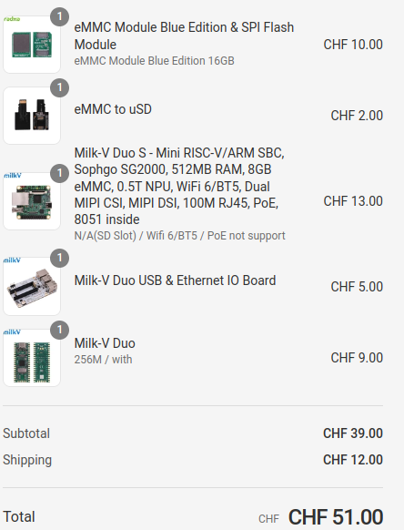

# https://github.com/kinsamanka/meta-milkv

Order at Arace




## Other links

* https://github.com/riscv/meta-riscv/blob/master/kas/milkv-duo.yml
* PR: https://github.com/riscv/meta-riscv/pull/486/files

## Duo USB&Ethernet Board

https://milkv.io/docs/duo/io-board/usb-ethernet-iob

[Schematics](https://github.com/milkv-duo/accessories/blob/master/Duo_USB%26Ethernet_IOB/duo_iob_v1.11.pdf)

## Duo

* [Entry page](https://milkv.io/duo)

* [Datasheet](https://github.com/milkv-duo/duo-files/blob/main/duo/datasheet/CV1800B-CV1801B-Preliminary-Datasheet-full-en.pdf)

* [HW Datasheet](https://github.com/milkv-duo/duo-files/blob/main/duo/hardware/duo-datasheet-v1.2.pdf)

* [HW Schematics](https://github.com/milkv-duo/duo-files/blob/main/duo/hardware/duo-schematic-v1.2.pdf)

* 

**Getting started**

* [Duo Docs](https://milkv.io/docs/duo/overview)

* [Boot the Duo](https://milkv.io/docs/duo/getting-started/boot)

* [Setup](https://milkv.io/docs/duo/getting-started/setup)
  * USB to TTL serial cable

    | Milk V | RS232 | Comment |
    | - | - | - |
    | GND | GND | green |
    | GPIO13 (RX) | TX | blue |
    | GPIO12 (TX) | RX | mangenta |

    `minicom -b 115200 -8 -D /dev/ttyUSB0`

# Use Dockerfile

## Build

See: docker_compile.sh

oe/meta-milkv/kas-project.yml:
- machine: milkv-duo
+ machine: milkv-duo256m

```
-    url: "https://github.com/riscv/meta-riscv"
-    refspec: "scarthgap"
+    url: "https://github.com/kinsamanka/meta-riskv"
+    refspec: "milkv_duos_256m"

# rm oe/meta-riscv/recipes-bsp/u-boot/files/0001-skip-cvitek-board-init.patch
# rm oe/meta-milkv/recipes-bsp/u-boot/files/0001-skip-cvitek-board-init.patch

oe/meta-milkv/recipes-bsp/u-boot/u-boot_%.bbappend
- file://0001-skip-cvitek-board-init.patch \
+ 
```

`time kas build meta-milkv/kas-project.yml`

* Build on github, 16-core, 64GB RAM, 128GB, xxx s
* Build on Lenovo T14s, i7, xxx s

## Flash and run

```bash
export SDCARD=/dev/sda
sudo umount ${SDCARD}1
sudo umount ${SDCARD}2
zcat oe/build/tmp-musl/deploy/images/milkv-duo/core-image-minimal-milkv-duo.rootfs.wic.gz | \
  sudo dd of=${SDCARD} bs=4M iflag=fullblock oflag=direct conv=fsync status=progress
```

eMMC: 246MB, 11s
sdcard: 246MB, 11s


build/tmp-musl/work/riscv64-oe-linux-musl/zephyr-blinky/3.6.0+git/git/milkv_duo/boards/riscv/milkv-duo/milkv_duo.yaml