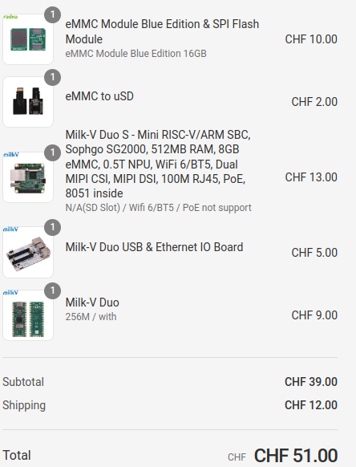

# https://github.com/kinsamanka/meta-milkv

## Open tasks

blink only works for milkv-duo.

blinky has to be fixed in https://github.com/kinsamanka/milkv-zephyros/tree/master/boards

Order at Arace




## Other links

* https://github.com/riscv/meta-riscv/blob/master/kas/milkv-duo.yml
* PR: https://github.com/riscv/meta-riscv/pull/486/files

## Duo USB&Ethernet Board

https://milkv.io/docs/duo/io-board/usb-ethernet-iob

[Schematics](https://github.com/milkv-duo/accessories/blob/master/Duo_USB%26Ethernet_IOB/duo_iob_v1.11.pdf)

## Duo

* [Entry page](https://milkv.io/duo)

* [Datasheet](https://github.com/milkv-duo/duo-files/blob/main/duo/datasheet/CV1800B-CV1801B-Preliminary-Datasheet-full-en.pdf)

* [HW Datasheet](https://github.com/milkv-duo/duo-files/blob/main/duo/hardware/duo-datasheet-v1.2.pdf)

* [HW Schematics](https://github.com/milkv-duo/duo-files/blob/main/duo/hardware/duo-schematic-v1.2.pdf)

* 

**Getting started**

* [Duo Docs](https://milkv.io/docs/duo/overview)

* [Boot the Duo](https://milkv.io/docs/duo/getting-started/boot)

* [Setup](https://milkv.io/docs/duo/getting-started/setup)
  * USB to TTL serial cable

    | Milk V | RS232 | Comment |
    | - | - | - |
    | GND | GND | green |
    | GPIO13 (RX) | TX | blue |
    | GPIO12 (TX) | RX | mangenta |

    `minicom -b 115200 -8 -D /dev/ttyUSB0`

# Use Dockerfile

## Build

See: docker_compile.sh

```bash
mkdir oe
(
  cd oe
  git clone --depth=1 https://github.com/kinsamanka/meta-milkv
)

cd oe/meta-milkv

vi kas-project.yml
-    url: "https://github.com/riscv/meta-riscv"
-    refspec: "scarthgap"
+    url: "https://github.com/kinsamanka/meta-riskv"
+    refspec: "milkv_duos_256m"

rm recipes-bsp/u-boot/u-boot_%.bbappend

vi recipes-bsp/milkv-duo-fsbl/milkv-duo-fsbl.bbappend
- file://0001-updates.patch;patchdir=.. \
- file://0002-compile-fixes.patch;patchdir=.. \
+ 
+
```


```bash
cd oe
./yocto_docker/oe/run_kas_for_all.sh
```

| machine |  github, 16-core, 64GB RAM, 128GB | Build on Lenovo T14s, i7 |
| - | - | - |
| milkv_duo | 27min |  |
| milkv | 3min |  |
| milkv_duos | 3min |  |

## Flash and run

```bash
export KAS_MACHINE=milkv-duo256m
export SDCARD=/dev/sda
sudo umount ${SDCARD}1
sudo umount ${SDCARD}2
zcat oe/build/tmp-musl/deploy/images/milkv-duo/core-image-minimal-${KAS_MACHINE}.rootfs.wic.gz | \
  sudo dd of=${SDCARD} bs=4M iflag=fullblock oflag=direct conv=fsync status=progress
```

eMMC: 246MB, 11s
sdcard: 246MB, 11s
